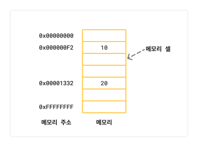
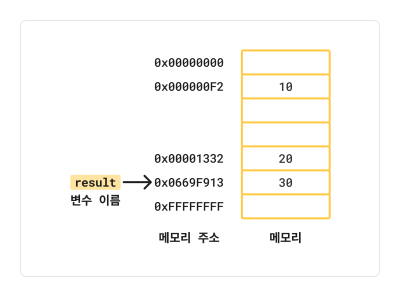
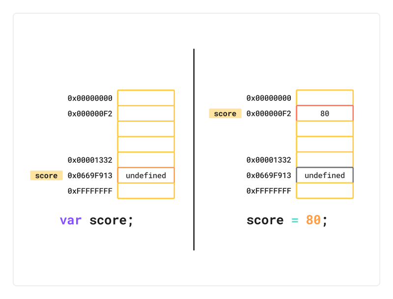

# Chapter 4 - 변수
<br />

## 변수 처리 과정

```javascript
10 + 20
```

컴퓨터는 위와 같은 연산에서
10 과 20 을 이진수로 변환하여 임의로 결정된 메모리 주소에 정보를 저장한다.  



다만 결과 30 을 재사용하기 위해서는 결과가 저장된 메모리 공간에 직접 접근해야 하는데,  
직접적인 메모리 제어는 매우 위험하기 때문에 변수를 통해 그 공간을 식별한다.  
<br />

> **변수는 하나의 값을 저장하기 위해 확보한 메모리 공간 자체 또는 그 메모리 공간을 식별하기 위해 붙인 이름을 말한다**

<br />

변수는 값이 저장된 메모리 공간의 주소로 치환되어 실행되기 때문에  
직접 메모리 주소에 접근하지 않고 안전하게 접근할 수 있다.  

<br />


## 식별자

식별자는 어떤 값을 구별해서 식별할 수 있는 고유한 이름을 말한다.  

```javascript
var result = 10 + 20;
```
위의 코드에서 식별자 `result` 는 30 을 저장하는 것이 아닌, 
30 을 저장하고 있는 메모리 주소를 저장한다.  



> **이처럼 식별자는 값이 아니라 메모리 주소를 기억하고 있다.**

<br />


## 변수 선언
변수 선언이란 변수를 생성하는 것을 의미한다.  
자세히는 값을 저장하기 위한 메모리 공간을 확보하고 변수 이름과 확보된 메모리 공간의 주소를
연결해서 값을 저장할 수 있게 준비하는 것이다.  

변수 선언에 의해 확보된 공간은 확보가 해제되기 전까지는 누구도 확보된 메모리 공간을 사용할 수 없도록 보호된다.  

<br />


### `var` 키워드 에 의한 선언

```javascript
var score;
```

자바스크립트 엔진은 변수 선언을 다음과 같은 2단계에 걸쳐 수행한다.  

1. 선언 단계   
변수 이름을 등록해서 자바스크립트 엔진에 변수의 존재를 알린다

2. 초기화 단계   
값을 저장하기 위한 메모리 공간을 확보하고 암묵적으로 `undefined` 를 할당해 초기화한다

`var` 키워드를 사용한 변수 선언은 선언 단계와 초기화 단계가 동시에 진행되어  
어떤 값도 할당하지 않아도 암묵적으로 `undefined` 라는 값으로 초기화가 된다.  

만약 초기화 단계를 거치지 않으면 메모리 공간에는 이전에 다른 프로그램이 사용했던 값이
남아있을 수 있고, 이러한 쓰레기 값 (Garbage value) 가 나올 수 있다.  

`var` 키워드는 암묵적인 초기화를 수행하므로 이러한 위험으로부터 안전하다.  
<br />

> [!NOTE]
> **ReferenceError** (참조 에러)  
> 선언되지 않은 식별자에 접근했을 때 발생합니다

<br />

## 변수 선언의 실행 시점과 호이스팅

```javascript
console.log(score);

var score;
```
변수 선언문보다 변수를 참조하는 코드가 앞에 있다.  
자바스크립트는 한 줄씩 순차적으로 인터프리터에 의해 실행되기 때문에
참조 에러가 발생할 것 같지만, `undefined` 가 출력된다.  

<br />

> **변수 선언이 소스코드가 한 줄씩 순차적으로 실행되는 시점, 즉 런타임이 아니라 그 이전 단계에서 먼저 실행되기 때문이다**

<br />
자바스크립트 엔진은 먼저 소스코드의 평가 과정을 거치는데, 이때
모든 선언문 (변수, 함수...) 을 소스코드에서 먼저 실행한다.   

즉 변수 선언이 소스코드의 어디에 있든 상관없이 다른 코드보다 먼저 실행한다.  
<br />

> **이처럼 변수 선언문이 코드의 선두로 끌어 올려진 것처럼 동작하는 자바스크립트 고유의 특징을 변수 호이스팅 (variable hoisting) 이라고 한다**

<br />
모든 선언문은 런타임 이전 단계에서 먼저 실행되기 때문에,  
키워드를 사용해서 선언하는 모든 식별자는 호이스팅 된다.


## 값의 할당
```javascript
var score;
score = 80;
```
```javascript
var score = 80;
```
값은 위와 같이 할당할 수 있다.
모두 동일하게 동작하는 코드이다.  

**다만 변수 선언은 소스코드가 순차적으로 실행되는 시점인 런타임 이전에 먼저 실행되지만  
값의 할당은 소스코드가 순차적으로 실행되는 시점인 런타임에 실행된다.**

<br />

```javascript
console.log(score); // A

var score;
score = 80;

console.log(score); // B
```
변수 선언은 런타임 이전에 실행되기 때문에 `undefined` 가 A 줄에선 출력되지만,  
런타임에 80 으로 변경되어 B 줄에선 `80` 이 출력된다.  



위처럼 이전 값이 저장되어 있던 메모리 공간을 지우고 그 메모리 공간에  
할당 값 80 을 새롭게 저장하는 것이 아니라 새로운 메모리 공간을 확보하고 그곳에 할당 값 80을 저장한다.

<br />

## 값의 재할당

`var` 키워드로 선언한 변수는 값을 재할당할 수 있다.  
다만 재할당 과정에서 새로운 메모리 공간을 확보하고 그 메모리 공간에 값을 저장하기 때문에, 불필요한 값들이 발생한다.  

이러한 불필요한 값들은 가비지 콜렉터에 의해 메모리에서 자동 해제된다.  
단, 메모리에서 언제 해제될지는 예측할 수 없다.  